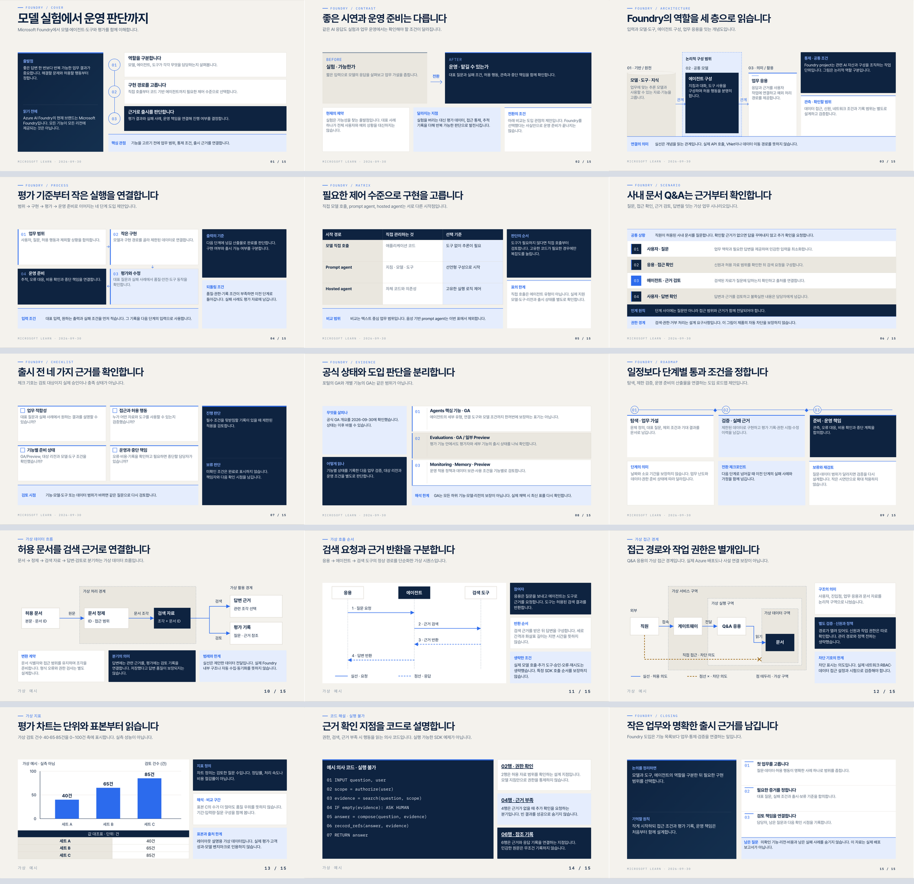
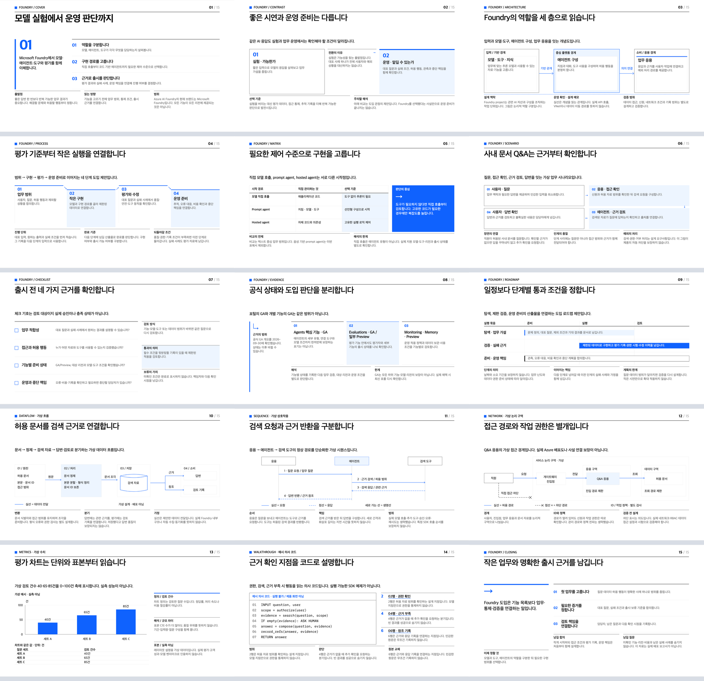

# doc-and-deck-skills

**주제와 Markdown 원고를 읽는 HTML 문서·PowerPoint로 만들고, 기존 결과물을 원본 우선으로
옮기는 10개의 독립 에이전트 스킬**입니다.
**Deep Navy 15종 + White Cobalt 15종, 총 30개의 HTML 레이아웃 예시**를 제공합니다.

발표 슬라이드뿐 아니라 목차·상세 설명·발표 스크립트가 함께 있는 읽기 자료를 만들 때 사용합니다.
스킬은 `SKILL.md` 지침, 디자인 템플릿, 실행 도구를 묶은 폴더입니다.
에이전트가 내용을 해석하고 배치를 작성하는 워크플로이며 **임의 파일을 한 번에 변환하는 범용 CLI는 아닙니다.**

[템플릿 카탈로그](#템플릿-카탈로그) · [스킬 목록](#스킬-목록) · [설치와 호출](#설치와-호출) ·
[전체 슬래시 명령어](#전체-슬래시-명령어) · [샘플 스크린샷](#샘플-스크린샷) ·
[샘플 파일·PDF·출처](samples/README.md)

## 어떤 작업에 쓰나요

| 가지고 있는 것 | 원하는 결과 | 선택할 스킬 접미사 |
|---|---|---|
| 주제·대상·목적 | 공식 자료 조사·내부 원고 작성 후 단일 HTML | `topic-to-html` |
| Markdown 원고 | 목차·설명·스크립트가 있는 HTML | `md-to-html` |
| Markdown 원고 | 편집 가능한 PowerPoint | `md-to-pptx` |
| 해당 테마의 HTML | 시트 디자인·등장 효과를 옮긴 PowerPoint | `html-to-pptx` |
| 기존 PowerPoint | 원본 시트·노트·전사를 보존한 읽는 HTML | `pptx-to-html` |

각 접미사 앞에 `deep-navy-` 또는 `white-cobalt-`를 붙입니다.
한 스킬만 사용할 때 다른 스킬을 먼저 설치할 필요는 없습니다.
아래 샘플에서 앞 단계의 결과를 입력으로 쓰는 것은 작업 연결 예시이지 설치 의존성이 아닙니다.

### 두 디자인 계열

| 계열 | HTML 디자인 기준 | 주요 글꼴 |
|---|---|---|
| Deep Navy | 웜 페이퍼 `#F4F2ED`, 네이비 `#0E2340`, 코발트 `#2C6BED` | Manrope · Pretendard |
| White Cobalt | 순백 `#FFFFFF`, 니어블랙 `#0E0E0E`, 코발트 `#0F62FE`, 각진 블록과 가는 선 | Archivo · IBM Plex Sans KR |

두 계열은 색만 바꾼 같은 레이아웃이 아닙니다. 각 스킬에 15종 HTML 디자인 기준을 동봉하며,
내용에 맞는 배치가 없으면 같은 디자인 원칙으로 새 레이아웃을 작성합니다.
HTML 읽기 UI는 좌측 목차, 세로 스크롤, 장별 설명·스크립트 접기, 키보드 조작, 모바일·인쇄를 제공합니다.

**경로별 차이:** Deep Navy의 기본 MD→PPTX는 네이티브 재조판이고,
White Cobalt MD→PPTX는 중간 HTML을 만든 뒤 포팅합니다.
PPTX→HTML에서는 테마가 바깥 읽기 UI에만 적용되며 **원본 시트를 다시 디자인하지 않습니다.**
이번 Deep Navy MD→PPTX 샘플은 15종 전체를 보여주기 위해 동봉 HTML 디자인을
측정하는 작업별 생성기를 사용했습니다. 기본 네이티브 생성기와는 별도 경로이며 정적 PPTX입니다.

**모든 `*-to-html` 스킬의 기본 최종 전달물은 HTML 파일 하나입니다.**
폰트·이미지·스타일·스크립트를 내장하며 외부 출처 링크는 그대로 둡니다.
원고·조각·추출 폴더는 내부 작업물이지 함께 복사해야 하는 실행 의존성이 아닙니다.

## 템플릿 카탈로그

**스킬 개수와 템플릿 개수는 다릅니다.**
스킬 10개는 입출력 방식 5가지 × 디자인 계열 2가지이고,
템플릿은 정보 구조 15가지 × 디자인 계열 2가지입니다.
같은 계열의 여러 스킬에 디자인 기준을 동봉하므로, 파일 복사본을 별도 템플릿으로 세지는 않습니다.

| 템플릿 키 | 용도 | 담는 내용 |
|---|---|---|
| `cover` | 표지 | 주제, 핵심 질문, 읽는 관점 |
| `contrast` | 대조·비교 | 이전과 이후, 두 관점, 변화의 조건 |
| `architecture` | 아키텍처·구성도 | 구성 요소, 포함 관계, 논리 경계 |
| `process` | 프로세스 | 단계별 작업, 입력·출력, 인계 |
| `matrix` | 비교표·매트릭스 | 같은 기준으로 비교하는 선택지 |
| `scenario` | 시나리오 | 역할별 상황·행동, 사용 사례 |
| `checklist` | 체크리스트 | 실행 전 확인, 진행·보류 조건 |
| `evidence` | 근거 보드 | 관찰한 사실, 해석, 한계 |
| `roadmap` | 로드맵 | 단계, 산출물, 다음 단계로 넘어가는 조건 |
| `dataflow` | 데이터 흐름 | 수집·변환·저장·소비와 분기 |
| `sequence` | 시퀀스 | 참여자별 요청·응답과 실행 순서 |
| `network` | 네트워크·접근 경계 | 구역, 접근 경로, 권한·허용·차단 |
| `metrics` | 지표·차트 | 값, 단위, 기준선, 비례 비교 |
| `walkthrough` | 코드·화면 해설 | 원본 코드 또는 화면과 번호별 설명 |
| `closing` | 마무리 | 결론, 합의, 다음 행동 |

전체 디자인은 동봉 HTML 갤러리에서 볼 수 있습니다. 아래 파일을 내려받아 브라우저에서 열면
각 계열의 15개 템플릿을 목차로 이동하며 확인할 수 있습니다.

- [Deep Navy 전체 15종 갤러리](skills/deep-navy-md-to-html/deck.html)
- [White Cobalt 전체 15종 갤러리](skills/white-cobalt-md-to-html/deck.html)

**Foundry 샘플 10개는 모두 15장입니다.** 각 계열의 실제 템플릿 15종을 위 순서대로 한 번씩
사용합니다. 이름만 붙인 동일 배치가 아니라 동봉 템플릿의 구조·도형 배치를 채웠습니다.
PPTX→HTML은 15종을 사용한 원본 PPTX의 시트를 보존합니다.
위 목록은 HTML 디자인 기준이지 네이티브 PPTX 생성기의 자동 지원 `kind` 목록이 아닙니다.
필요한 레이아웃은 작업별로 구현하며, **15종에 맞는 배치가 없으면 같은 스킨으로 새로 만들 수 있습니다.**

## 스킬 목록

스킬 이름은 사용 지침으로 연결됩니다. 모든 샘플은 **Microsoft Foundry on Azure**를 주제로
만들었으며, **모든 경로가 15종 × 1장 = 15장**입니다.

| 스킬 | 입력 → 출력 | 샘플 결과 | 스크린샷 |
|---|---|---|---|
| [deep-navy-md-to-html](skills/deep-navy-md-to-html/SKILL.md) | Markdown → 단일 HTML | [HTML](samples/deep-navy-md-to-html/foundry.html) | [15장](samples/previews/deep-navy-md-to-html/overview.png) |
| [deep-navy-topic-to-html](skills/deep-navy-topic-to-html/SKILL.md) | 주제 → 단일 HTML | [HTML](samples/deep-navy-topic-to-html/topic.html) | [15장](samples/previews/deep-navy-topic-to-html/overview.png) |
| [deep-navy-md-to-pptx](skills/deep-navy-md-to-pptx/SKILL.md) | Markdown → PPTX | [PPTX](samples/deep-navy-md-to-pptx/foundry.pptx) | [15장](samples/previews/deep-navy-md-to-pptx/overview.png) |
| [deep-navy-html-to-pptx](skills/deep-navy-html-to-pptx/SKILL.md) | HTML → PPTX | [PPTX](samples/deep-navy-html-to-pptx/foundry.pptx) | [15장](samples/previews/deep-navy-html-to-pptx/overview.png) |
| [deep-navy-pptx-to-html](skills/deep-navy-pptx-to-html/SKILL.md) | PPTX → 단일 보존 HTML | [HTML](samples/deep-navy-pptx-to-html/index.html) | [15장](samples/previews/deep-navy-pptx-to-html/overview.png) |
| [white-cobalt-md-to-html](skills/white-cobalt-md-to-html/SKILL.md) | Markdown → 단일 HTML | [HTML](samples/white-cobalt-md-to-html/foundry.html) | [15장](samples/previews/white-cobalt-md-to-html/overview.png) |
| [white-cobalt-topic-to-html](skills/white-cobalt-topic-to-html/SKILL.md) | 주제 → 단일 HTML | [HTML](samples/white-cobalt-topic-to-html/topic.html) | [15장](samples/previews/white-cobalt-topic-to-html/overview.png) |
| [white-cobalt-md-to-pptx](skills/white-cobalt-md-to-pptx/SKILL.md) | Markdown → HTML → PPTX | [PPTX](samples/white-cobalt-md-to-pptx/foundry.pptx) | [15장](samples/previews/white-cobalt-md-to-pptx/overview.png) |
| [white-cobalt-html-to-pptx](skills/white-cobalt-html-to-pptx/SKILL.md) | HTML → PPTX | [PPTX](samples/white-cobalt-html-to-pptx/foundry.pptx) | [15장](samples/previews/white-cobalt-html-to-pptx/overview.png) |
| [white-cobalt-pptx-to-html](skills/white-cobalt-pptx-to-html/SKILL.md) | PPTX → 단일 보존 HTML | [HTML](samples/white-cobalt-pptx-to-html/index.html) | [15장](samples/previews/white-cobalt-pptx-to-html/overview.png) |

## 설치와 호출

### GitHub Copilot CLI에 설치

이 저장소의 `skills/`는 배포용 원본 위치입니다. 단순히 저장소를 복제하는 것과
에이전트가 스킬을 발견하도록 설치하는 것은 별개입니다.
`SKILL.md`만 옮기지 말고 **해당 스킬 폴더 전체**를 복사하세요.

다음은 macOS/Linux 셸에서 저장소를 복제하고, 10개 스킬을 개인 스킬로 설치하는 예시입니다.
`cp -i`는 같은 이름의 파일이 있으면 덮어쓸지 묻습니다. 기존 수정본이 있다면 먼저 백업하세요.

```sh
git clone https://github.com/hijigoo/doc-and-deck-skills.git
cd doc-and-deck-skills
mkdir -p "$HOME/.copilot/skills"
cp -R -i skills/* "$HOME/.copilot/skills/"
```

일부만 필요하면 `skills/*` 대신 `skills/deep-navy-md-to-html`처럼 원하는 폴더를 지정합니다.
한 프로젝트에서만 쓰려면 대상 저장소의 `.github/skills/<스킬명>/`에 폴더 전체를 둡니다.
실행 환경·폰트·렌더 앱은 별도로 준비해야 하며, 필요한 패키지는 각 폴더의 명세를 따릅니다.

Copilot CLI의 대화 입력창에서 다음 명령으로 다시 불러오고 위치를 확인합니다.

```text
/skills reload
/skills list
/skills info deep-navy-md-to-html
```

설치·명시적 호출 방식은 [GitHub Copilot CLI 공식 스킬 안내](https://docs.github.com/en/copilot/how-tos/copilot-cli/customize-copilot/add-skills)를 참고하세요.
다른 에이전트에서는 그 도구의 스킬 검색 경로와 호출 방식을 따릅니다.

### 실행 환경

| 작업 | 준비할 것 |
|---|---|
| 완성된 HTML 보기 | 브라우저. GitHub의 파일 링크는 라이브 HTML 미리보기가 아니므로 내려받아 열기 |
| HTML 조각 조립 | Python 3.9+ |
| 브라우저 자동 확인 | Node.js 22+, 해당 스킬의 Playwright, Chromium |
| PPTX 생성·추출 | 해당 스킬의 `package.json` / `requirements.txt` |
| PPTX 렌더·PDF·PNG 생성 | PowerPoint 또는 LibreOffice, PDF/이미지 도구 Poppler |
| 주제 조사 | 공식 문서에 접근할 수 있는 검색·웹 도구 |

## 전체 슬래시 명령어

아래 코드 블록은 **터미널 명령이 아니라 에이전트 대화창에 한 번에 붙여 넣는 전체 요청문**입니다.
스킬 설치 후 이 저장소 루트에서 작업하며, 파일 경로도 저장소 루트 기준입니다.

**기록 구분:** 이번 Foundry 샘플은 에이전트가 각 `SKILL.md`의 절차를 수행하고 동봉 도구와
샘플 생성 스크립트를 실행해 만들었습니다. 아래 문장은 그 작업을 다시 요청하기 위한
**슬래시 호출 예시이며, 과거에 입력한 명령을 그대로 옮긴 로그는 아닙니다.**
보관된 샘플을 다시 빌드하는 셸 명령은 [샘플 재생성](#샘플-재생성)에 별도로 있습니다.

예시는 결과 비교를 위해 기존 `samples/` 경로를 사용합니다. 다시 요청하면 파일이 바뀔 수 있으므로
기존 샘플을 유지하려면 출력 경로를 다른 작업 폴더로 바꾸세요.
에이전트의 재작성·재조사 결과가 저장된 샘플과 픽셀 단위로 같다는 뜻은 아닙니다.

### deep-navy-md-to-html

```text
/deep-navy-md-to-html samples/shared/foundry.md를 읽고 Microsoft Foundry on Azure를 소개하는 한국어 15장 읽는 HTML 문서를 만들어줘.
스킬의 deck.html에 있는 15개 템플릿을 원래 순서대로 각각 한 번씩 모두 사용해줘.
Deep Navy 디자인을 사용하고 원고의 순서, 핵심 메시지, 표 전체, 상세 설명, 발표 스크립트와 공식 출처 URL을 보존해줘.
좌측 목차, 세로 스크롤, 장별 노트 접기, 키보드 조작, 모바일 및 인쇄 기능을 유지해줘.
폰트·스타일·스크립트·이미지를 내장해 samples/deep-navy-md-to-html/foundry.html 하나로 완성해줘.
조각 HTML은 내부 작업 폴더에만 두고, 최종 파일만 빈 폴더로 복사해 오프라인에서도 확인해줘.
15장 전체 미리보기는 실행 의존성과 분리해 samples/previews/deep-navy-md-to-html/overview.png에 저장해줘.
```

### deep-navy-topic-to-html

```text
/deep-navy-topic-to-html Azure의 Microsoft Foundry를 주제로 개발자와 기술 의사결정자를 위한 한국어 입문 자료 15장을 만들어줘.
스킬의 deck.html에 있는 15개 템플릿을 원래 순서대로 각각 한 번씩 모두 사용해줘.
Microsoft Learn 공식 문서를 조사하고 현재 제품명, 모델·에이전트·도구의 역할, 구현 경로 비교, 평가·관측, GA/Preview와 도입 시 제약을 설명해줘.
사내 문서 Q&A와 출시 판단 기준을 설명용 가상 사례로 포함하고 실제 배포 사실과 구분해줘. 실제 Azure 리소스는 만들지 마.
장별 핵심 메시지, 상세 설명, 발표 스크립트, 출처 URL과 확인일을 포함한 원고를 먼저 작성한 뒤 Deep Navy 읽는 HTML로 만들어줘.
원고는 내부 작업 폴더에 두고 폰트·스타일·스크립트·이미지를 내장한 samples/deep-navy-topic-to-html/topic.html 하나만 최종 전달해줘.
최종 파일만 빈 폴더로 복사해 오프라인에서 확인하고 전체 미리보기는 samples/previews/deep-navy-topic-to-html/overview.png에 별도 저장해줘.
```

### deep-navy-md-to-pptx

```text
/deep-navy-md-to-pptx samples/shared/foundry.md를 Deep Navy의 한국어 15장 PowerPoint로 만들어줘.
기본 네이티브 배치만 반복하지 말고 스킬의 deck.html에 있는 15종을 순서대로 모두 구현해줘.
중간 HTML을 구성·측정하고 작업별 PptxGenJS 생성기로 포팅해 원고의 메시지, 표의 모든 행과 열, 순서와 출처를 보존해줘. 이 샘플은 정적 PPTX로 만들어줘.
텍스트·표·도형은 편집 가능한 객체로 만들고 상세 설명, 발표 스크립트와 출처 URL은 장별 발표자 노트에 넣어줘.
복합 SVG와 CSS 장식만 개별 이미지 객체로 보존하고 전체 슬라이드를 이미지로 바꾸지 마.
samples/deep-navy-md-to-pptx/foundry.pptx에 저장하고 intermediate.html, 측정값과 PDF를 함께 정리해줘.
장별 PNG와 전체 미리보기는 samples/previews/deep-navy-md-to-pptx/에 저장하고 PowerPoint 앱에서 확인하지 못한 동작은 미확인으로 밝혀줘.
```

### deep-navy-html-to-pptx

```text
/deep-navy-html-to-pptx samples/deep-navy-md-to-html/foundry.html을 원본 15장의 디자인과 등장 효과를 보존하는 PowerPoint로 포팅해줘.
실제 시트 좌표, 글꼴, 줄바꿈, 색, 표와 타이밍을 측정하고 편집 가능한 텍스트·표·도형으로 구현해줘. 전체 시트를 이미지로 바꾸거나 새 레이아웃으로 재조판하지 마.
웹 목차와 버튼은 슬라이드에서 제외하고 상세 설명, 발표 스크립트와 출처 URL은 장별 발표자 노트에 보존해줘.
15종 레이아웃을 모두 유지하고 복합 SVG와 CSS 장식만 개별 이미지 객체로 보존해줘.
samples/deep-navy-html-to-pptx/foundry.pptx에 저장하고 작업별 생성기, 측정값, 애니메이션 매니페스트와 PDF를 정리해줘.
전체 미리보기는 samples/previews/deep-navy-html-to-pptx/overview.png에 저장해줘.
실제 앱에서 확인하지 못한 열기·재생 동작은 미확인으로 밝혀줘.
```

### deep-navy-pptx-to-html

```text
/deep-navy-pptx-to-html samples/deep-navy-html-to-pptx/foundry.pptx를 원본 보존형 읽는 HTML로 만들어줘.
15종 템플릿을 사용한 원본 15장의 순서, 제목, 본문, 표 전체, 배치, 원본 자산과 발표자 노트를 유지하고 Deep Navy는 바깥 목차·설명 UI에만 적용해줘.
LibreOffice로 PDF를 내보내 정적 시트 렌더를 사용하고, 복사 가능한 전사·출처·노트와 원본 및 자산 해시를 함께 보존해줘.
페이지·폰트·이미지와 원본/PDF 다운로드·보존 기록을 HTML 내부에 내장해 samples/deep-navy-pptx-to-html/index.html 하나만 최종 전달해줘.
추출 파일은 내부 작업용으로 두고 단일 파일 오프라인 확인 후 전체 미리보기는 samples/previews/deep-navy-pptx-to-html/overview.png에 저장해줘.
정적 렌더이며 편집 가능한 시트 HTML이나 애니메이션 복제가 아니라는 점을 명시해줘.
```

### white-cobalt-md-to-html

```text
/white-cobalt-md-to-html samples/shared/foundry.md를 읽고 Microsoft Foundry on Azure를 소개하는 한국어 15장 읽는 HTML 문서를 만들어줘.
스킬의 deck.html에 있는 15개 템플릿을 원래 순서대로 각각 한 번씩 모두 사용해줘.
White Cobalt의 순백·코발트, 각진 블록과 가는 선을 사용하고 원고의 순서, 핵심 메시지, 표 전체, 상세 설명, 발표 스크립트와 공식 출처 URL을 보존해줘.
좌측 목차, 세로 스크롤, 장별 노트 접기, 키보드 조작, 모바일 및 인쇄 기능을 유지해줘.
폰트·스타일·스크립트·이미지를 내장해 samples/white-cobalt-md-to-html/foundry.html 하나로 완성해줘.
조각 HTML은 내부 작업 폴더에만 두고, 최종 파일만 빈 폴더로 복사해 오프라인에서도 확인해줘.
15장 전체 미리보기는 실행 의존성과 분리해 samples/previews/white-cobalt-md-to-html/overview.png에 저장해줘.
```

### white-cobalt-topic-to-html

```text
/white-cobalt-topic-to-html Azure의 Microsoft Foundry를 주제로 개발자와 기술 의사결정자를 위한 한국어 입문 자료 15장을 만들어줘.
스킬의 deck.html에 있는 15개 템플릿을 원래 순서대로 각각 한 번씩 모두 사용해줘.
Microsoft Learn 공식 문서를 조사하고 현재 제품명, 모델·에이전트·도구의 역할, 구현 경로 비교, 평가·관측, GA/Preview와 도입 시 제약을 설명해줘.
사내 문서 Q&A와 출시 판단 기준을 설명용 가상 사례로 포함하고 실제 배포 사실과 구분해줘. 실제 Azure 리소스는 만들지 마.
장별 핵심 메시지, 상세 설명, 발표 스크립트, 출처 URL과 확인일을 포함한 원고를 먼저 작성한 뒤 White Cobalt 읽는 HTML로 만들어줘.
원고는 내부 작업 폴더에 두고 폰트·스타일·스크립트·이미지를 내장한 samples/white-cobalt-topic-to-html/topic.html 하나만 최종 전달해줘.
최종 파일만 빈 폴더로 복사해 오프라인에서 확인하고 전체 미리보기는 samples/previews/white-cobalt-topic-to-html/overview.png에 별도 저장해줘.
```

### white-cobalt-md-to-pptx

```text
/white-cobalt-md-to-pptx samples/shared/foundry.md를 한국어 15장 White Cobalt PowerPoint로 만들어줘.
스킬의 deck.html에 있는 15개 템플릿을 원래 순서대로 각각 한 번씩 모두 사용해줘.
이 스킬 안의 템플릿으로 intermediate.html을 먼저 만들고 실제 시트 좌표·글꼴·표와 등장 타이밍을 측정해 편집 가능한 PPTX로 포팅해줘.
일반 네이티브 테마로 재조판하지 말고 중간 HTML의 디자인을 유지해줘. 웹 UI는 제외하고 상세 설명, 발표 스크립트와 출처 URL은 발표자 노트에 보존해줘.
텍스트·표·기본 도형은 편집 가능하게 유지하고 복합 SVG와 CSS 장식만 개별 이미지로 보존해줘.
samples/white-cobalt-md-to-pptx/foundry.pptx에 저장하고 같은 폴더에 intermediate.html, 측정값, 애니메이션 매니페스트와 PDF를 정리해줘.
전체 미리보기는 samples/previews/white-cobalt-md-to-pptx/overview.png에 저장해줘.
실제 앱에서 확인하지 못한 열기·재생 동작은 미확인으로 밝혀줘.
```

### white-cobalt-html-to-pptx

```text
/white-cobalt-html-to-pptx samples/white-cobalt-md-to-html/foundry.html을 원본 15장의 디자인과 등장 효과를 보존하는 PowerPoint로 포팅해줘.
실제 시트 좌표, 글꼴, 줄바꿈, 색, 표와 타이밍을 측정하고 편집 가능한 텍스트·표·도형으로 구현해줘. 전체 시트를 이미지로 바꾸거나 새 레이아웃으로 재조판하지 마.
웹 목차와 버튼은 슬라이드에서 제외하고 상세 설명, 발표 스크립트와 출처 URL은 장별 발표자 노트에 보존해줘.
15종 레이아웃을 모두 유지하고 복합 SVG와 CSS 장식만 개별 이미지 객체로 보존해줘.
samples/white-cobalt-html-to-pptx/foundry.pptx에 저장하고 작업별 생성기, 측정값, 애니메이션 매니페스트와 PDF를 정리해줘.
전체 미리보기는 samples/previews/white-cobalt-html-to-pptx/overview.png에 저장해줘.
실제 앱에서 확인하지 못한 열기·재생 동작은 미확인으로 밝혀줘.
```

### white-cobalt-pptx-to-html

```text
/white-cobalt-pptx-to-html samples/white-cobalt-html-to-pptx/foundry.pptx를 원본 보존형 읽는 HTML로 만들어줘.
15종 템플릿을 사용한 원본 15장의 순서, 제목, 본문, 표 전체, 배치, 원본 자산과 발표자 노트를 유지하고 White Cobalt는 바깥 목차·설명 UI에만 적용해줘.
LibreOffice로 PDF를 내보내 정적 시트 렌더를 사용하고, 복사 가능한 전사·출처·노트와 원본 및 자산 해시를 함께 보존해줘.
페이지·폰트·이미지와 원본/PDF 다운로드·보존 기록을 HTML 내부에 내장해 samples/white-cobalt-pptx-to-html/index.html 하나만 최종 전달해줘.
추출 파일은 내부 작업용으로 두고 단일 파일 오프라인 확인 후 전체 미리보기는 samples/previews/white-cobalt-pptx-to-html/overview.png에 저장해줘.
정적 렌더이며 편집 가능한 시트 HTML이나 애니메이션 복제가 아니라는 점을 명시해줘.
```

## 샘플 스크린샷

아래는 실제 생성 결과의 PNG 미리보기입니다. **HTML은 브라우저 캡처, PPTX는 LibreOffice PDF 렌더**를
사용했습니다. 정지 이미지로는 애니메이션이나 노트 접기 같은 동작을 확인할 수 없습니다.
10개 결과 각각의 전체 이미지 링크는 [스킬 목록](#스킬-목록)에 있습니다.

### Deep Navy · Markdown → HTML



### White Cobalt · Markdown → HTML



<details>
<summary>Deep Navy PowerPoint 15종 미리보기</summary>


</details>

## 샘플 재생성

샘플은 **HTML 6개 + PPTX 4개**이며 PDF, 장별 PNG, 원고, 출처, 폰트·라이선스를 함께 제공합니다.
원고와 시트는 에이전트가 작성했습니다. 공식 문서 확인일은 **2026-09-30**이며,
설명용 도입 예시를 실제 배포 결과나 성능 측정으로 제시하지 않습니다.

[samples/scripts/build.cjs](samples/scripts/build.cjs)는 각 스킬의 도구를 연결해 보관된 원고와
작성된 레이아웃으로 샘플을 다시 만듭니다. 임의 주제를 새로 조사하거나 임의 HTML을 변환하는
스크립트가 아닙니다. 전체 생성 경로와 보존 범위는 [샘플 README](samples/README.md)에 있습니다.

앞서 안내한 실행 환경을 준비한 뒤 **저장소 루트의 Bash 셸**에서 실행합니다.
아래 명령은 기존 샘플 결과를 다시 쓰므로 사용자 편집본은 다른 위치에 보관하세요.

```sh
npm --prefix samples ci
(cd samples && npx --no-install playwright install chromium)
python3 -m venv samples/.venv
samples/.venv/bin/python -m pip install -r samples/requirements.txt
PYTHON="$PWD/samples/.venv/bin/python" npm --prefix samples run build
npm --prefix samples run verify
samples/.venv/bin/python samples/scripts/check_content.py
```

## 폴더 구성

```text
skills/
  <스킬명>/
    SKILL.md          사용 조건과 작업 절차
    deck.html         동봉 디자인 기준과 읽기 UI
    references/       독립 실행·작성·보존 지침
    scripts/          조립·변환 보조·검사 도구
    package.json      Node.js 의존성
    requirements.txt  Python 의존성 — 필요한 스킬에만 포함
samples/
  README.md           결과 목록·출처·재생성·확인 범위
  shared/             공통 원고와 공식 출처
  assets/             공유 폰트와 라이선스
  scripts/            이 샘플 전용 생성·확인 코드
  previews/<스킬명>/  장별 PNG, 5장 묶음과 전체 미리보기
  <to-html 스킬명>/   최종 HTML 하나
  <to-pptx 스킬명>/   PPTX, PDF, 측정값과 중간 HTML(해당 경로)
  .cache/work/        조각·원고·추출 자산 등 내부 작업물 — Git 제외
```

## 보존 범위와 주의사항

- **독립성:** 스킬 폴더 하나에 필요한 지침·템플릿·도구를 포함합니다.
  Node.js/Python, 브라우저, 렌더 앱과 폰트까지 내장한 실행 파일이라는 뜻은 아닙니다.
- **HTML → PPTX:** 편집 가능한 텍스트·표·도형을 우선하고 지원 가능한 등장 효과를 대응시킵니다.
  임의 웹 인터랙션·클릭·반복 효과나 앱 간 픽셀 단위 동일성을 보장하지 않습니다.
- **PPTX → HTML:** 이번 샘플은 정적 원본 렌더와 별도 전사·노트를 보존합니다.
  편집 가능한 시트 텍스트·애니메이션·영상의 HTML 복제가 아닙니다.
- **폰트와 배포:** 샘플 HTML은 해당 파일 하나만 내려받아 열거나 공유하면 됩니다.
  PPTX에는 폰트를 임베드하지 않았습니다. [동봉 폰트](samples/assets/fonts/)를 설치하거나 PDF로 확인하세요.
- **확인 한계:** 이번 샘플은 PowerPoint 앱에서 직접 열기·애니메이션 재생을 확인하지 않았습니다.
  렌더·내용 대조의 구체적인 범위는 [샘플 확인 기록과 한계](samples/README.md#확인-범위와-한계)에 있습니다.
- **출처와 권리:** 공식 출처는 원고와 장별 노트에 남깁니다.
  동봉 폰트에는 각 [라이선스와 고지](samples/README.md#폴더-구성)를 따르며,
  별도 입력 이미지·로고·문서도 사용 권한을 확인해야 합니다.
