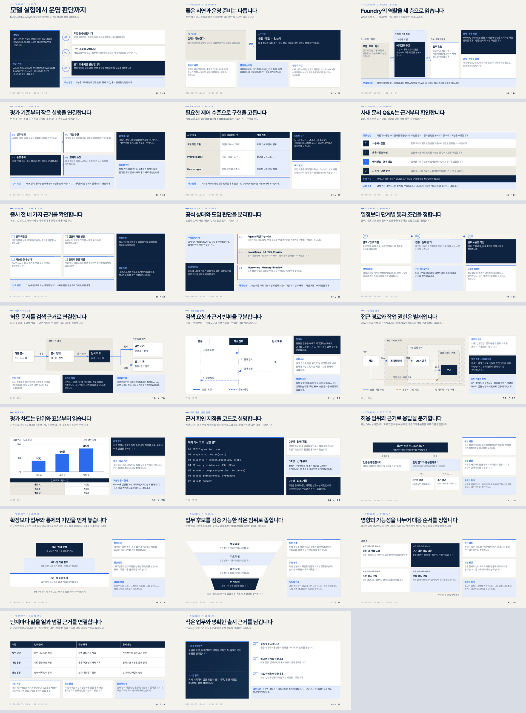
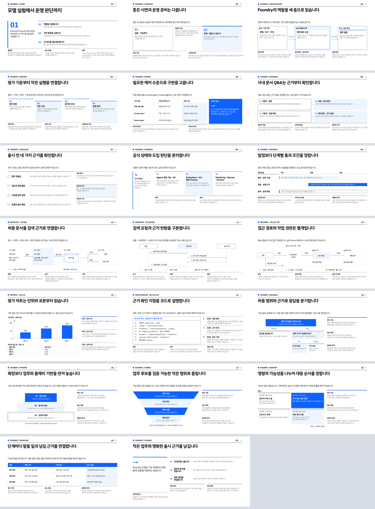

# Microsoft Foundry · 스킬별 샘플

**10개 스킬 모두 각 테마의 20종 템플릿을 전부 사용한 20장 샘플**입니다.
주요 결과는 **단일 HTML 6개 + PPTX 4개**이며, PPTX에는 PDF도 제공합니다.
공식 문서 확인일은 **2026-09-30**입니다. 현재 제품명인 Microsoft Foundry를 사용합니다.

[저장소·스킬 소개](../README.md) · [스킬 설치](../README.md#설치와-호출) ·
[10개 스킬의 전체 슬래시 호출 예시](../README.md#전체-슬래시-명령어)

## 결과 파일

| 스킬 | 주요 결과 | 분량 | 미리보기 / PDF |
|---|---|---:|---|
| `deep-navy-md-to-html` | [foundry.html](deep-navy-md-to-html/foundry.html) | 20장 | [전체 미리보기](previews/deep-navy-md-to-html/overview.png) |
| `deep-navy-topic-to-html` | [topic.html](deep-navy-topic-to-html/topic.html) | 20장 | [전체 미리보기](previews/deep-navy-topic-to-html/overview.png) |
| `deep-navy-md-to-pptx` | [foundry.pptx](deep-navy-md-to-pptx/foundry.pptx) | 20장 | [미리보기](previews/deep-navy-md-to-pptx/overview.png) · [PDF](deep-navy-md-to-pptx/foundry.pdf) |
| `deep-navy-html-to-pptx` | [foundry.pptx](deep-navy-html-to-pptx/foundry.pptx) | 20장 | [미리보기](previews/deep-navy-html-to-pptx/overview.png) · [PDF](deep-navy-html-to-pptx/foundry.pdf) |
| `deep-navy-pptx-to-html` | [index.html](deep-navy-pptx-to-html/index.html) | 20장 | [전체 미리보기](previews/deep-navy-pptx-to-html/overview.png) |
| `white-cobalt-md-to-html` | [foundry.html](white-cobalt-md-to-html/foundry.html) | 20장 | [전체 미리보기](previews/white-cobalt-md-to-html/overview.png) |
| `white-cobalt-topic-to-html` | [topic.html](white-cobalt-topic-to-html/topic.html) | 20장 | [전체 미리보기](previews/white-cobalt-topic-to-html/overview.png) |
| `white-cobalt-md-to-pptx` | [foundry.pptx](white-cobalt-md-to-pptx/foundry.pptx) | 20장 | [미리보기](previews/white-cobalt-md-to-pptx/overview.png) · [PDF](white-cobalt-md-to-pptx/foundry.pdf) |
| `white-cobalt-html-to-pptx` | [foundry.pptx](white-cobalt-html-to-pptx/foundry.pptx) | 20장 | [미리보기](previews/white-cobalt-html-to-pptx/overview.png) · [PDF](white-cobalt-html-to-pptx/foundry.pdf) |
| `white-cobalt-pptx-to-html` | [index.html](white-cobalt-pptx-to-html/index.html) | 20장 | [전체 미리보기](previews/white-cobalt-pptx-to-html/overview.png) |

**HTML은 해당 파일 하나만 내려받아 브라우저에서 열거나 공유하면 됩니다.**
폰트·스타일·스크립트·이미지를 내장했으며 출처 웹페이지 링크만 외부로 연결됩니다.
GitHub 파일 화면은 라이브 HTML 미리보기가 아닙니다.
PPTX에는 폰트를 임베드하지 않았으므로 [동봉 폰트](assets/fonts/)를 설치하거나 PDF로 확인하세요.

## 20종 전체 사용

각 결과의 장 번호가 아래 템플릿과 대응합니다. 실제 `deck.html`의 구조와 도형 배치를 유지하고
Foundry 내용으로 채웠으며 템플릿 이름만 바꾼 반복 배치가 아닙니다.

| 장 | 템플릿 | Foundry 내용 |
|---|---|---|
| 01 | `cover` | 모델 실험에서 운영 판단까지 |
| 02 | `contrast` | 좋은 시연과 운영 준비의 차이 |
| 03 | `architecture` | 모델·도구·에이전트·앱의 개념 관계 |
| 04 | `process` | 범위·구현·평가·운영 준비 |
| 05 | `matrix` | 직접 호출·프롬프트 에이전트·호스팅 에이전트 비교 |
| 06 | `scenario` | 가상 사내 문서 Q&A |
| 07 | `checklist` | 출시 전 확인할 근거 |
| 08 | `evidence` | 공식 GA/Preview 사실과 도입 판단 구분 |
| 09 | `roadmap` | 일정 약속이 아닌 단계별 통과 조건 |
| 10 | `dataflow` | 허용 문서에서 검색 근거까지 |
| 11 | `sequence` | 검색 요청과 근거 반환 |
| 12 | `network` | 개념적 접근 경계·작업 권한 |
| 13 | `metrics` | 가상 검토 질문 수 40·65·85건 |
| 14 | `walkthrough` | 권한·근거 확인 의사 코드 |
| 15 | `decision` | 허용 범위·근거의 조건별 응답 분기 |
| 16 | `pyramid` | 업무·통제 기반에서 검증·확장으로 |
| 17 | `funnel` | 업무 후보에서 제한 실험·범위 합의로 |
| 18 | `riskmap` | 가정한 영향·가능성별 대응 우선순위 |
| 19 | `swimlane` | 업무·개발·운영 역할별 행동과 인계 |
| 20 | `closing` | 작은 업무와 명확한 출시 근거 |

[catalog.json](catalog.json)에 각 결과의 20개 레이아웃, 원본 템플릿 및 장별 SHA-256 대응을 기록했습니다.
두 테마의 빈 디자인 갤러리는 [루트 템플릿 카탈로그](../README.md#템플릿-카탈로그)에 있습니다.

## 실제 생성 경로

| 경로 | 수행한 작업 |
|---|---|
| 주제 → HTML | 공식 문서 조사·20장 내부 원고 → 해당 스킬 템플릿 채우기·조립 → 단일 HTML 마감 |
| Markdown → HTML | 공통 20장 원고 → 해당 스킬의 실제 20종 템플릿 → 단일 HTML 마감 |
| Deep Navy Markdown → PPTX | 자체 동봉 템플릿으로 중간 HTML → 작업별 측정·PptxGenJS 생성기 → 정적 PPTX |
| White Cobalt Markdown → PPTX | 자체 중간 HTML → 브라우저 측정 → 네이티브 객체·등장 효과 |
| HTML → PPTX | MD→HTML 결과 → 실제 좌표·폰트·표 측정 → 네이티브 객체·등장 효과 |
| PPTX → HTML | HTML→PPTX 결과 → LibreOffice PDF → 원본 시트·전사·노트·자산을 단일 HTML에 내장 |

Deep Navy MD→PPTX 샘플은 기본 네이티브 생성기의 제한된 배치를 반복하지 않고,
스킬이 허용하는 **작업별 생성기 경로**로 20종 디자인을 구현했습니다.
PPTX의 텍스트·표·기본 도형은 편집 가능하지만 **복합 SVG 다이어그램과 일부 CSS 장식은
개별 PNG 객체**입니다. 전체 슬라이드를 한 이미지로 평탄화하지는 않았습니다.

두 MD→PPTX의 `intermediate.html`은 포팅 근거입니다. 같은 테마의 HTML→PPTX와 디자인은 같고,
Deep Navy MD→PPTX에는 등장 효과를 넣지 않았습니다.
`scripts/`는 이번 원고 스키마와 동봉 템플릿 두 계열을 위한 **샘플 전용 코드**이며
임의 주제를 조사하거나 모든 HTML을 자동 변환하는 도구가 아닙니다.

## 조각 HTML과 최종 전달물

예전 `chapters.html`은 CSS·폰트·읽기 UI가 없는 **조립용 조각**이라 직접 열면 배치가 깨졌습니다.
이제 조각은 `.cache/work/<스킬명>/chapters.fragment.html`에만 두며 결과 폴더에는 배포하지 않습니다.
각 `*-to-html` 결과 폴더의 `foundry.html`, `topic.html` 또는 `index.html`만 열면 됩니다.
주제 조사 원고와 PPTX 추출 페이지·자산 폴더도 내부 작업물로 옮겼습니다.

PPTX→HTML에는 원본/PDF 다운로드, 원본 미디어, 보존 JSON과 해시가 내장되어 있습니다.
원본 파일의 바이트 보존과 브라우저에서 보이는 정적 렌더는 별도로 검사합니다.
스크린샷은 문서 설명용이며 HTML 실행에 필요한 동반 파일이 아닙니다.

## 내용과 출처

[공통 20장 원고](shared/foundry.md) · [주제 조사 범위](shared/topic-brief.md) ·
[공식 출처·주장 범위·확인일](shared/sources.json)

출처는 Microsoft Learn의 Foundry 개요, Agent Service 개요, Observability, GA 개요입니다.
HTML 장별 설명과 PPTX 발표자 노트에 상세 설명·스크립트·출처 URL을 보존했습니다.
도입 절차·다이어그램·Q&A·출시 게이트는 **설명용 제안**, 차트는 **가상 수치**,
코드는 **실행 불가능한 의사 코드**입니다. 실제 배포·구독 접근·과금·성능 측정은 하지 않았으며
가격·특정 리전·쿼터를 보장하지 않습니다.
추가된 피라미드·퍼널의 크기는 수치 비례가 아니며 위험도 맵의 위치와 스윔레인 역할은
가상의 설계 가정입니다. 실제 위험 평가·성숙도 점수·조직별 책임 배정으로 해석하지 않습니다.

## 폴더 구성

```text
shared/              원고·조사 범위·공식 출처
assets/fonts/        재생성/PPTX용 폰트·OFL 라이선스·SHA-256
scripts/             실제 템플릿 채우기·생성·내용 및 오프라인 검사
previews/<스킬명>/    slide-01.png~slide-20.png, group-1~4.png, overview.png
<to-html 스킬명>/     최종 HTML 하나
<to-pptx 스킬명>/     PPTX·PDF·측정값·타이밍, MD 경로의 intermediate.html
.cache/work/         내부 원고·조각·추출·보존 기록 — Git 제외
```

Pretendard, IBM Plex Sans KR, Manrope, Archivo, IBM Plex Mono를 사용합니다.
각 HTML에는 폰트 파일뿐 아니라 OFL 고지문도 포함했습니다.
실제 Azure 제품 로고나 포털 화면을 모방한 자산은 사용하지 않았습니다.

## 재생성

Node.js 22+, Python 3.9+, LibreOffice(`soffice`), Poppler(`pdfinfo`, `pdftoppm`,
`pdftocairo`, `pdftotext`)가 필요합니다. 저장소의 `samples/`에서 다음 Bash 명령을 실행합니다.
기존 결과를 다시 쓰므로 사용자 편집본은 다른 위치에 보관하세요.

```sh
npm ci
npx --no-install playwright install chromium
python3 -m venv .venv
.venv/bin/python -m pip install -r requirements.txt
PYTHON="$PWD/.venv/bin/python" npm run build
npm test
npm run verify
.venv/bin/python scripts/check_content.py
```

폰트 다운로드는 필요하지 않습니다. 누락된 배포본에서만 `python3 scripts/fetch_fonts.py`를 실행하세요.
LibreOffice 렌더는 동봉 폰트를 가리키는 임시 Fontconfig와 격리된 프로필을 사용합니다.
PptxGenJS 표 ID는 타이밍 주입 전에 정규화합니다. 기존 사용자 파일에 적용하는 도구가 아닙니다.
보존 내용 검사는 전체 빌드가 만든 `.cache/work/`와 HTML 내부 바이트를 함께 대조합니다.

## 확인 범위와 한계

[HTML 확인 기록](validation.json) · [PPTX 내용·보존 확인 기록](content-validation.json)

10개 스킬의 원본 템플릿 갤러리와 두 MD→PPTX 중간 HTML도 1600/768/390px에서 검사합니다.
`npm test`는 20종의 순서·중복·누락, 10개 독립 복사본, 슬롯 채움과 테마별 헤더 계약을 확인합니다.
HTML 6개는 1600/768/390px에서 목차·노트 대응을 확인하고, **파일 하나만 빈 폴더에 복사한
네트워크 차단 브라우저**에서도 자원·런타임 오류, 노트 접기, 인쇄 표시와 텍스트 넘침을 검사했습니다.
PPTX 4개는 20장·본문·네이티브 표·노트·출처·도형 범위·타이밍 참조와
LibreOffice PDF의 한글 제목을 검사했습니다. 원본/PDF/미디어의 내장 바이트 해시도 대조합니다.

**PowerPoint 앱에서 직접 열기와 애니메이션 재생 검사는 수행하지 않았습니다.**
브라우저와 Office의 글꼴 래스터화·자간·easing은 완전히 같지 않을 수 있습니다.
PPTX→HTML의 시트는 정적 원본 렌더이며 편집 가능한 HTML 도형이나 애니메이션·영상 복제가 아닙니다.
복사 가능한 전사와 발표자 노트는 시트 아래에 따로 있습니다.

## 테마 미리보기

### Deep Navy · 20종 HTML → PPTX



### White Cobalt · 20종 HTML → PPTX


